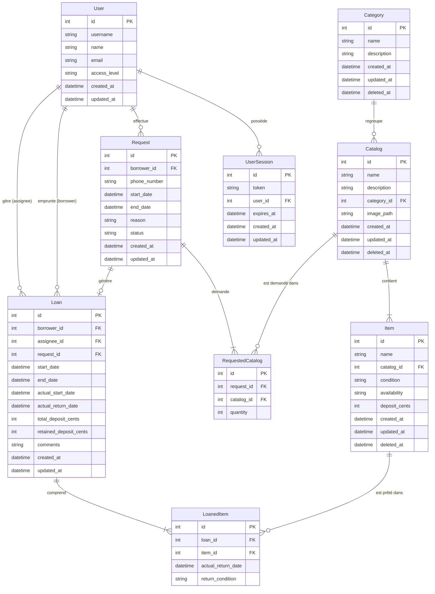

# Matos CLAP

L'application de gestion et de prêt de matériel audiovisuel du CLAP (Centrale Lille Audiovisuel Production).

Elle permet aux adhérents de CLA de parcourir le catalogue et de soumettre des demandes de réservation. L'équipe du CLAP
traite ensuite ces requêtes depuis un backoffice dédié : création de prêts, suivi des retours, inventaire en temps réel,
planning et gestion des utilisateurs.

## Architecture & Stack technique

* Backend : API REST avec [FastAPI](https://fastapi.tiangolo.com/) et [SQLModel](https://sqlmodel.tiangolo.com/)
  (Python), gérée avec l'écosystème [uv](https://docs.astral.sh/uv/) et adossée à une base de données PostgreSQL.
* Frontend : SPA
  sous [React](https://fr.react.dev/) / [Vite](https://vite.dev/) / [TypeScript](https://www.typescriptlang.org/). Elle
  consomme un client d'API TypeScript généré automatiquement à partir du
  schéma [OpenAPI](https://swagger.io/specification/) du backend.
* Base de données : Gestion des migrations avec [Alembic](https://alembic.sqlalchemy.org/en/latest/).

## Schéma Relationnel de la BDD

Voici l'[ERD](https://mermaid.ai/open-source/syntax/entityRelationshipDiagram.html) de la base de données (utilisateurs,
catalogue, gestion des articles et flux des prêts) :



## Lancement en local

### 1. Configuration globale (Bypass du SSO en Dev)

L'autentification passe par le SSO de CLA. En développement, vous pouvez la court-circuiter avec le flag
`ENABLE_DEV_LOGIN` : le bouton de connexion ouvrira automatiquement une session admin sur le premier utilisateur de la
base.

### 2. Démarrage du Backend

Le backend nécessite `uv` et une instance PostgreSQL active.

Créez un fichier `backend/.env` :

```dotenv
DB_HOST=localhost
DB_PORT=5432
DB_NAME=matos_clap
DB_USER=postgres
DB_PASSWORD=postgres

# development ou production
ENV=development
ENABLE_DEV_LOGIN=true

```

Lancez ensuite les commandes suivantes :

```bash
cd backend
uv sync                     # Installe les dépendances
uv run alembic upgrade head # Applique les dernières migrations
uv run main.py              # Lance l'API sur http://localhost:8000
```

> [!TIP]
> La documentation interactive Swagger est disponible sur `/docs` (en mode `development` seulement).

### 3. Démarrage du Frontend

Le frontend nécessite Node.js.

Créez un fichier `frontend/.env.local` :

```dotenv
VITE_ENABLE_DEV_LOGIN=true
```

Lancez ensuite le serveur de développement :

```bash
cd frontend
npm install
npm run dev # Disponible sur http://localhost:5173
```

> [!NOTE]
> Les préfixes `/api` et `/media` sont automatiquement proxifiés par Vite vers le serveur backend.

## Déploiement avec Docker

Pour lancer l'ensemble de la stack (Frontend, Backend, Nginx et PostgreSQL) en une seule commande :

```bash
docker compose up --build
```

* Application (Frontend) : `http://localhost:3000`
* API (Backend) : `http://localhost:8000`
* Un reverse-proxy Nginx distribue le frontend et relaie de manière transparente les appels `/api/` et `/media/` vers le
  conteneur du backend.

## Commandes utiles

### Gestion de la Base de données (Alembic)

Toutes les commandes s'exécutent depuis le dossier `backend/` :

* Appliquer les migrations : `uv run alembic upgrade head`
* Générer une nouvelle migration : `uv run alembic revision --autogenerate -m "description_du_changement"`
* Annuler la dernière migration (downgrade) : `uv run alembic downgrade -1`

### Initialisation du premier administrateur

Pour promouvoir un utilisateur au rôle `admin`, une fois qu'il s'est connecté au moins une fois :

```bash
cd backend
uv run python -m db.bootstrap_admin <username>
```

### Qualité du code & Tests (CI/CD)

Pour s'assurer que le code est propre avant de push :

* Backend :
    * Linter & Formatter : `uv run ruff check && uv run ruff format`
    * Vérification des types : `uv run ty check`
    * Tests unitaires : `uv run pytest`

* Frontend :
    * Linter : `npm run lint`
    * Formatter : `npm run format`
    * Validation du Build : `npm run build`

> [!TIP]
> Pre-commit hooks : Vous pouvez installer les hooks locaux avec `uv run pre-commit install` dans le dossier backend.

## Structure du projet

* `backend/` : Code source de l'API FastAPI, modèles SQLModel, scripts de migration Alembic et tests unitaires.
* `frontend/` : Code de l'application React. Consultez le [document dédié](frontend/README.md) pour obtenir tous les
  détails sur la stack frontend.
