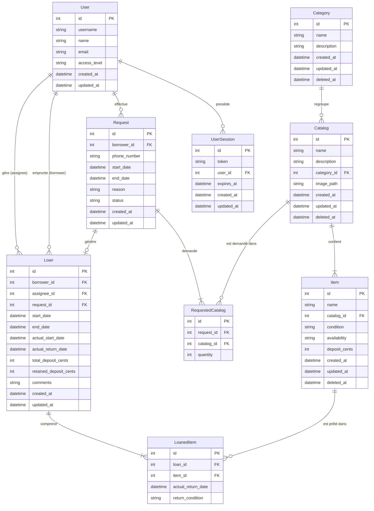

# Matos CLAP

L'application de gestion et de prêt de matériel audiovisuel du CLAP (Centrale Lille Audiovisuel Production).

Elle permet aux adhérents de CLA de parcourir le catalogue et de soumettre des demandes de réservation. L'équipe du CLAP
traite ensuite ces requêtes depuis un backoffice dédié : création de prêts, suivi des retours, inventaire en temps réel,
planning et gestion des utilisateurs.

## Architecture & Stack technique

* Backend : API REST avec [FastAPI](https://fastapi.tiangolo.com/) et [SQLModel](https://sqlmodel.tiangolo.com/)
  (Python), gérée avec l'écosystème [uv](https://docs.astral.sh/uv/) et adossée à une base de données PostgreSQL.
* Frontend : SPA
  sous [React](https://fr.react.dev/) / [Vite](https://vite.dev/) / [TypeScript](https://www.typescriptlang.org/). Elle
  consomme un client d'API TypeScript généré automatiquement à partir du
  schéma [OpenAPI](https://swagger.io/specification/) du backend.
* Base de données : Gestion des migrations avec [Alembic](https://alembic.sqlalchemy.org/en/latest/).

## Schéma Relationnel de la BDD

Voici l'[ERD](https://mermaid.ai/open-source/syntax/entityRelationshipDiagram.html) de la base de données (utilisateurs,
catalogue, gestion des articles et flux des prêts) :



## Lancement en local

### Prérequis

| Outil      | Version | Utilisé pour        |
|------------|---------|---------------------|
| uv         | —       | Dépendences Backend |
| Python     | 3.14    | Backend             |
| Node.js    | 22      | Frontend            |
| PostgreSQL | 18      | Base de données     |

### 1. Configuration globale (Bypass du SSO en Dev)

L'authentification passe par le SSO de CLA. En développement, vous pouvez la court-circuiter avec le flag
`ENABLE_DEV_LOGIN` : le bouton de connexion ouvrira automatiquement une session admin sur le premier utilisateur de la
base de données.

### 2. Démarrage du Backend

Créez la base de données :

```bash
createdb matos_clap
```

Créez un fichier `backend/.env` :

```dotenv
DB_HOST=localhost
DB_PORT=5432
DB_NAME=matos_clap
DB_USER=postgres
DB_PASSWORD=postgres

ENV=development
ENABLE_DEV_LOGIN=true
SESSION_COOKIE_SECURE=false
```

Lancez ensuite les commandes suivantes :

```bash
cd backend
uv sync                     # Installe les dépendances
uv run alembic upgrade head # Applique les dernières migrations
uv run fastapi dev          # Lance l'API sur http://localhost:8000
```

> [!TIP]
> La documentation interactive Swagger est disponible sur `/docs` (en mode `development` seulement).

### 3. Démarrage du Frontend

```bash
cd frontend
npm install
npm run generate:client
npm run dev # Disponible sur http://localhost:5173
```

Créez également un fichier `frontend/.env.local` :

```dotenv
VITE_ENABLE_DEV_LOGIN=true
```

> [!NOTE]
> Les préfixes `/api` et `/media` sont automatiquement proxifiés par Vite vers le serveur backend.

### 4. Créer le premier administrateur

Aucune route d'API ne crée d'utilisateur : les comptes proviennent du SSO de CLA. Sur une base vide, créez
donc le premier administrateur à la main :

```bash
cd backend
uv run python -m db.bootstrap_admin <username> --create
```

Vous pouvez maintenant vous connecter (bouton de connexion en dev, ou SSO).

## Déploiement avec Docker

L'image Docker est un monolithe : un build multi-stage compile le frontend puis copie le résultat statique dans l'image
du backend, qui le sert lui-même via `app.frontend()` en plus de l'API.

`docker-compose.yml` fait tourner cette image en local, avec un service `db` jetable.

```bash
docker compose up --build
docker compose exec app uv run --no-sync alembic upgrade head
docker compose exec app uv run --no-sync python -m db.bootstrap_admin <username> --create
```

Application (Frontend + API + médias) : `http://localhost:8000`

> [!NOTE]
> La stack locale active `ENABLE_DEV_LOGIN`. Le workflow de release ne passe pas le build arg :
les images publiées sur GHCR gardent le défaut `false` et n'exposent pas ce bypass.

## Déploiement

Le workflow `.github/workflows/release.yml` construit et publie l'image sur GHCR à chaque tag `vX.Y.Z` :

```bash
git tag -a v1.2.3 -m "Description de la release"
git push origin v1.2.3
```

Tags d'image produits pour `v1.2.3` : `1.2.3`, `1.2`, `1` et `latest`.

### Releases avec migration

N'oubliez pas d'appliquer la migration sur le serveur, pour que l'image mise à jour démarre correctement.

## Commandes utiles

### Gestion de la Base de données (Alembic)

Toutes les commandes s'exécutent depuis le dossier `backend/` :

* Appliquer les migrations : `uv run alembic upgrade head`
* Générer une nouvelle migration : `uv run alembic revision --autogenerate -m "description_du_changement"`
* Annuler la dernière migration (downgrade) : `uv run alembic downgrade -1`

### Import / export CSV

L'import est un upsert basé sur la colonne `id` : `id` vide insère une nouvelle ligne, `id` renseigné met à jour la
ligne correspondante. Rien n'est jamais supprimé. Si une seule ligne est invalide, l'import entier est rejeté
avec un message par ligne fautive, et rien n'est écrit. Le séparateur (`,` ou `;`) est détecté automatiquement.

Les clés étrangères sont référencées **par nom**, il faut donc importer dans cet ordre :

| Ordre | Fichier      | Colonnes obligatoires          | Colonnes facultatives               |
|-------|--------------|--------------------------------|-------------------------------------|
| 1     | `categories` | `name`                         | `id`, `description`                 |
| 2     | `catalogs`   | `name`, `category`             | `id`, `description`, `image_path`   |
| 3     | `items`      | `name`, `catalog`, `condition` | `id`, `availability`, `deposit_eur` |

* `condition` : `new`, `good` ou `degraded`
* `availability` : `available`, `maintenance` ou `retired` (défaut : `available`)
* `deposit_eur` : montant en euros, `.` ou `,` comme séparateur décimal (défaut : `0`)

> [!TIP]
> Le plus simple pour partir sur de bonnes bases : exporter les trois fichiers depuis l'interface, les remplir, puis
> les réimporter dans l'ordre ci-dessus.

### Initialisation du premier administrateur

Pour promouvoir un utilisateur au rôle `admin`, une fois qu'il s'est connecté au moins une fois :

```bash
cd backend
uv run python -m db.bootstrap_admin <username>
```

Sur une base vide où personne ne s'est encore connecté, ajoutez `--create` pour créer le compte.

### Qualité du code & Tests (CI/CD)

Pour s'assurer que le code est propre avant de push :

* Backend :
    * Linter & Formatter : `uv run ruff check && uv run ruff format`
    * Vérification des types : `uv run ty check`
    * Tests unitaires : `uv run pytest`

* Frontend :
    * Linter : `npm run lint`
    * Formatter : `npm run format`
    * Validation du Build : `npm run build`

> [!TIP]
> Pre-commit hooks : Vous pouvez installer les hooks locaux avec `uv run pre-commit install` dans le dossier backend.

## Structure du projet

* `backend/` : Code source de l'API FastAPI, modèles SQLModel, scripts de migration Alembic et tests unitaires.
* `frontend/` : Code de l'application React. Consultez le [document dédié](frontend/README.md) pour obtenir tous les
  détails sur la stack frontend.
